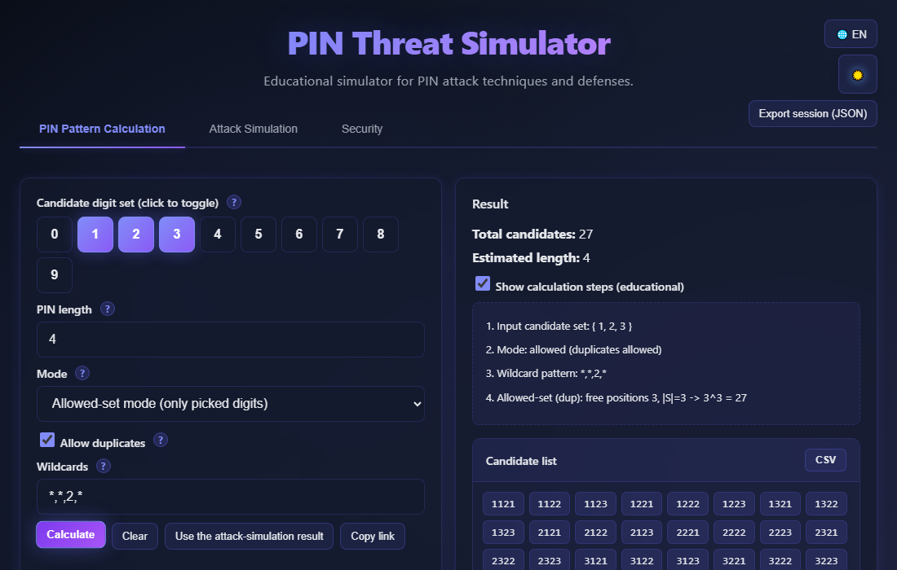
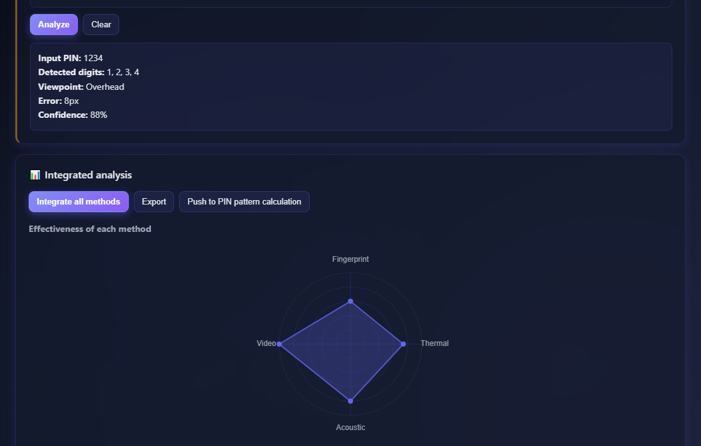
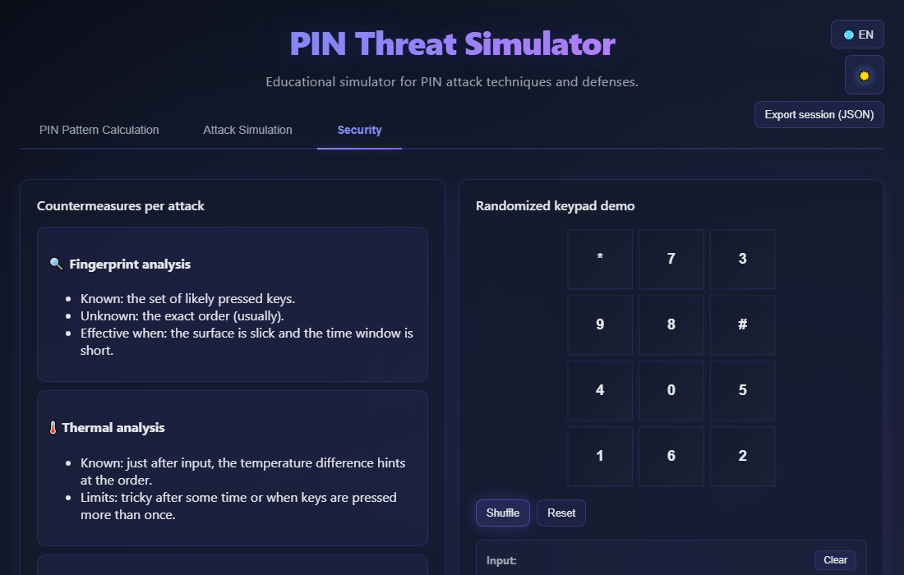

English · [日本語](README.md)

# PIN Threat Simulator - PIN Authentication Attack Simulator


[](https://ipusiron.github.io/pin-threat-simulator/)

**Day088 - 100 Security Tools with Generative AI**

**PIN Threat Simulator** is an educational tool that simulates how PIN authentication can be attacked and demonstrates why the recommended defenses actually work.

The supported attack methods are:

- Fingerprint residue analysis
- Thermal analysis
- Acoustic analysis
- Shoulder-surfing (including over-the-shoulder observation)

---

## 🌐 Demo

👉 **[https://ipusiron.github.io/pin-threat-simulator/](https://ipusiron.github.io/pin-threat-simulator/)**

Open the demo and try it directly in your browser.

---

## 📸 Screenshots

>
>*Calculation tab: candidate set {1,2,3} with `*,*,2,*` narrows the space to 27 PINs, with the steps, the candidate list, and the "Copy shareable link" button all in frame.*

>
>*Attack simulation tab: integrated analysis of four methods, scrolled so the radar chart and the estimated PIN ranking share the frame.*

>
>*Security tab: randomized keypad after a shuffle.*

---

## ✨ Features

- Runs entirely in the browser (no data leaves the client)
- No external APIs or third-party packages. Served straight from GitHub Pages
- The calculation engine is isolated in `pin-engine.js` and verified against a brute-force reference implementation
- Bilingual UI (JA / EN), resolved from `?lang=ja|en`, then `localStorage`, then the browser language
- Dark / light themes, respects `prefers-reduced-motion`, text contrast meets WCAG AA
- MIT license

---

## 📖 Usage

### Language switching

- Use the "🌐 EN" / "🌐 JA" button in the header to switch between English and Japanese
- Add `?lang=ja` or `?lang=en` to the URL to open the page in that language
- The chosen language is saved in `localStorage` and restored on the next visit
- On the first visit, the language resolves in this order: query string → `localStorage` → browser language

### 1. PIN Pattern Calculation

1. Click digits in "Candidate digit set" to pick those that may have been pressed
2. Set the PIN length, mode, and duplicate policy
3. If some positions are known, enter a wildcard pattern (e.g. `*,*,2,*`)
4. Press "Calculate" to see the total count and the enumerated list
5. Enable "Show calculation steps" to inspect each step of the formula

### 2. Attack Simulation

1. Click each keypad to set the density, temperature, keypress count, or PIN
2. Press "Analyze" on each card to run the individual analyzer
3. Press "Integrate all methods" on the right panel to see the radar chart, expert hints, and the estimated PIN ranking
4. Press "Push to PIN pattern calculation" to forward the result to the calc tab

#### Try the acoustic analyzer with the bundled sample

- The "Try sample" button on the acoustic card fetches the bundled `assets/samples/pin-taps-4.wav` (four taps, ~1.6 seconds) from the same origin and runs it through the existing peak-detection path
- To record your own sample: a quiet room, the device microphone, keep taps at least 0.3 seconds apart, keep the file under 20 MB, and use a format the browser's `decodeAudioData` accepts (typically WAV / MP3 / OGG / AAC)

#### Share the calc state via a link

- The "Copy shareable link" button on the calc tab copies a URL whose `#` fragment carries the candidate set, length, mode, duplicates, wildcards, and language
- If the clipboard call fails, an input field appears under the button with the URL so you can select it manually
- Opening the shared link reproduces the same state (useful for classroom or training distribution)

### 3. Security

1. Review the "known / unknown / defense" summary for each attack method
2. Try the randomized keypad demo to feel how a shuffle complicates visual attacks
3. Enable the hand-cover mode to see how masking input mid-way affects visibility

---

## 📐 Screen Layout

The tool is organized into three tabs.

### 1. PIN Pattern Calculation

- Candidate digit set, PIN length, mode (allowed set / must include / partial), duplicate policy
- Wildcard support with `*` for unknown positions
- Total count calculation, display limited to 1,000 entries, full list via CSV export
- "Show calculation steps" (educational) reveals every intermediate formula
- "Use the attack-simulation result" button pulls values back from the simulation tab

### 2. Attack Simulation

A single interface exposes every attack method side by side.

- 🔍 Fingerprint: click keypad to set density (0-100); keys above the threshold are flagged
- 🌡️ Thermal: click keypad to raise temperature (up to 40 degrees); real-time exponential decay (tau = 20s); press "Analyze" to freeze the state
- 🔊 Acoustic: click the keypad or upload an audio file to estimate the keypress count (PIN length)
- 📹 Shoulder-surfing: enter a PIN, then set viewpoint and pixel error to score detection

Integrated analysis panel:

- 📊 Radar chart that visualizes effectiveness per method
- 💡 Expert hints with risk-based countermeasures
- 🎯 Estimated PIN ranking (top 10) from the combined score
- "Integrate all methods" merges every analyzer; "Push to PIN pattern calculation" forwards it

### 3. Security

- Countermeasures per attack: 🔍 fingerprint, 🌡️ thermal, 🔊 acoustic, 📹 shoulder-surfing with known / unknown / defense notes
- Randomized keypad demo with shuffle and reset to feel the effect of layout randomization
- Operational checklist for defenders

---

## 🔍 Supported Attack Methods

### 1. Fingerprint Residue Analysis

Principle: Infer which keys were pressed from the oil residue left on the keypad.

Simulation:
- Each key has a configurable density (0-100)
- A threshold decides which keys are "likely pressed"
- Example: if 4-digit PIN uses detected set {2, 5, 9}, allowed-set mode with duplicates yields `3^4 = 81` candidates

Real-world techniques:
- Oblique lighting to reveal fingerprints
- UV lighting for trace detection
- Macro photography with a high-resolution sensor

Limits:
- Press order is usually unknown
- Residue fades with time
- Repeated use of the same digit is not detectable

---

### 2. Thermal Residue Analysis

Principle: A thermal camera reads the heat left by the fingers right after input to estimate the order.

Simulation:
- Real-time exponential decay (time constant tau = 20 seconds)
- Click the keypad to raise temperature (+10 per click, capped at 40 degrees)
- The elapsed-time slider (0-60s) advances automatically
- The hottest keys suggest the most recent presses (with a confidence value)

Mathematical model:

```
T(t) = T0 * exp(-t / tau)   (tau = 20 seconds)
```

The on-screen cooling curve is driven by `pin-engine.js`'s `thermalDecay(T0, t, tau=20)`, so the display matches the engine. Starting from T0 = 40 degrees, the temperature falls to about 14.72 degrees at t = 20s and to about 1.99 degrees at t = 60s.

Real-world techniques:
- Thermal cameras such as FLIR (ideally 320x240 or higher)
- Capture within 5-10 seconds after input is most effective
- Even differences as small as 0.5 degrees can be read

Limits:
- Information fades over time
- Ambient temperature changes the signal
- Keys pressed more than once accumulate heat

Combined effect:
- Fingerprint + thermal narrows both the candidate set and the order

---

### 3. Acoustic Analysis

Principle: Estimate the PIN length by analyzing keypress sound waveforms.

Simulation:
- Audio file upload (up to 20MB)
- Peak detection with hysteresis (rise = 0.3, fall = 0.1)
- Sampling stride: 200 samples per step

Real-world techniques:
- High-sensitivity microphones (directional preferred)
- Smartphone recorders
- Ideal distance: 1-3 meters

What you can get:
- ✅ High-accuracy estimate of the PIN length
- ❌ Identifying the digits is hard (needs reverberation / frequency analysis)

---

### 4. Shoulder-Surfing (Video Analysis)

Principle: Infer input visually with a camera or over-the-shoulder observation.

Simulation:
- Viewpoint (overhead / tilted)
- View-angle error in pixels (0-50px)
- Angle and distance degrade accuracy

#### Detection accuracy model

The viewing angle and pixel error affect detection as follows.

##### 1. Viewing angle

Overhead (`top`):
- Detections: every distinct input digit
- Confidence penalty: none (baseline 100%)
- Use case: top-mounted surveillance camera or an attacker photographing from directly above

Tilted (`tilt`):
- Detection count accuracy: `accuracy = max(0.5, 1 - pixelErr/50)`
  - Example: err = 8px -> accuracy = 84% -> detection count is 84% (16% less)
  - Example: err = 25px -> accuracy = 50% -> detection count is 50% (floor)
- Confidence penalty: -30%
- Use case: over-the-shoulder, cameras mounted at an angle

##### 2. Pixel error

Pixel error represents inaccuracy in coordinate detection due to camera resolution, distance, hand shake, and focus blur.

Low error (0-20px):
- Detections: unchanged (tilt still applies the accuracy formula above)
- Confidence penalty: `min(50, pixelErr * 1.5)%`
  - 8px -> -12%
  - 15px -> -22.5%
  - 20px -> -30%

High error (>20px):
- Detections halved (`ceil(candidates.length / 2)`)
- Confidence penalty: up to -50%
  - 25px -> -37.5%
  - 30px -> -45%
  - 40px or more -> -50% (cap)

#### Concrete examples

Case 1: ideal (overhead, low error)
- Settings: viewpoint = overhead, error = 8px
- Input PIN: 1234 (four distinct digits)
- Detections: 4 (100%)
- Confidence: 100 - 0 - 12 = 88%
- Radar score: `min(100, 4*15 + 88*0.5) = 100` (cap)

Case 2: overhead with high error
- Settings: viewpoint = overhead, error = 25px
- Input PIN: 1234
- Detections: 2 (high error halves them)
- Confidence: 100 - 0 - 37.5 = 62.5%
- Radar score: `2*15 + 62.5*0.5 = 61.25`

Case 3: tilted, low error
- Settings: viewpoint = tilted, error = 8px
- Input PIN: 1234
- Detections: `ceil(4 * 0.84) = 4`
- Confidence: 100 - 30 - 12 = 58%
- Radar score: `4*15 + 58*0.5 = 89`

Case 4: worst case (tilted, high error)
- Settings: viewpoint = tilted, error = 30px
- Input PIN: 1234
- Detections: `ceil(4 * 0.5) = 2` -> halved further -> 1
- Confidence: 100 - 30 - 45 = 25%
- Radar score: `1*15 + 25*0.5 = 27.5`

#### Score formula

```
score = min(100, candidates.length * 15 + confidence * 0.5)
```

**Hand covering is the single most effective defense, and a randomized keypad makes digit identification meaningless at the root.**
- Hand covers the screen: detection = 0%
- Randomized keypad: digit identification becomes meaningless
- Shielding with your body: forces the viewpoint toward "tilted" and increases error

---

## 🧮 PIN Pattern Calculation

The tool integrates signals from multiple attack methods and computes the realistic candidate count.
Inputs: candidate set S, length n, mode, duplicate policy, wildcards (length-n array, each element is `*` or a single digit).

### Modes

#### 1. Allowed-set mode (Allowed Set Mode)

Definition: Each position is drawn from S. Fixed positions are forced to the given digit; if that digit is not in S the count is 0.

Formulas:
- With duplicates: let f = free positions, A = |S|, then `A^f`
- Without duplicates: permutations over the remaining digits after fixed ones

Example 1 (with duplicates):
- Set: {2, 5, 9}, length: 4, no wildcards
- Count: `3^4 = 81`

Example 2 (with duplicates + fixed position):
- Set: {2, 5, 9}, length: 4, `*,*,2,*`
- Count: third position is 2, others have 3 choices -> `3 * 3 * 1 * 3 = 27`

Example 3 (no duplicates):
- Set: {1, 2, 3, 4}, length: 4, no wildcards
- Count: `4! = 24`

---

#### 2. Must-include mode (Must Include Mode)

Definition: Each position is from S, and **every element of S must appear at least once**.

Formula (with duplicates, inclusion-exclusion):

```
count = Sum_{i=0..k'} (-1)^i * C(k', i) * (A - i)^f

A  = |S|
f  = free positions (n - fixed)
R  = required digits not yet covered by fixed positions, k' = |R|
```

Formula (no duplicates):
- Only when `n == |S|` is the count non-zero
- Count is permutations of the remaining digits after fixed ones

Example 4 (with duplicates):
- Set: {1, 2, 3}, length: 4, no wildcards
- Count: `3^4 - C(3,1)*2^4 + C(3,2)*1^4 - C(3,3)*0^4 = 81 - 48 + 3 - 0 = 36`

Example 5 (with duplicates + fixed position):
- Set: {1, 2, 3}, length: 4, `*,*,2,*`
- The fixed 2 already covers one required digit, so R = {1, 3} (k' = 2), f = 3
- Count: `3^3 - C(2,1)*2^3 + C(2,2)*1^3 = 27 - 16 + 1 = 12`

---

#### 3. Partial mode (Partial Mode)

Definition: Each position is drawn from 0-9 (S is not used). Fixed positions behave the same way.

Formulas:
- With duplicates: `10^f`
- Without duplicates: permutations over the remaining digits

Example 6 (with duplicates):
- Length: 4, no wildcards
- Count: `10^4 = 10,000`

Example 7 (with duplicates + fixed position):
- Length: 4, `*,*,2,*`
- Count: `10^3 = 1,000`

---

### Wildcard format

- Comma-separated per position
- Each element is `*` (free) or a single digit
- Mismatched length or any invalid token causes the pattern to be ignored

### Duplicate control

With duplicates (default):
- The same digit can repeat
- Examples: 1111, 2255, 5929

Without duplicates:
- Each digit is used at most once
- Must-include + no-duplicates has candidates only when |S| equals length
- Example: {2, 5, 9}, length 3, no duplicates -> `3! = 6`

### Calculation limits

- When the count is large: allowed and must-include enumerate up to 5,000; partial up to 500
- Beyond those caps only the count is shown; the full list is not materialized
- The screen shows up to 1,000; CSV export gives the complete set

---

## 🛡️ Defense Demonstrations

### Randomized keypad

An interactive demo whose digits are shuffled each time. Defeats positional memory attacks such as fingerprint residue and shoulder-surfing.

- Shuffle: each press randomizes the digit layout
- Reset: restores the standard layout (1-9, *, 0, #)
- Click input: enter a PIN directly on the canvas

### Hand-cover mode (input masking simulation)

Simulates the realistic scenario of starting to cover the keypad with your hand partway through input.

#### Behavior

```
Step 1: Normal input
  Press 1, 2, 3, 4
  -> Display: 1234

Step 2: Enable hand-cover mode (become cautious)
  Toggle the checkbox ON
  -> Display: 1234 (already-entered digits stay visible)

Step 3: Hand covers while typing
  Press 5
  -> Display: 12345 (shown for the first 300ms only)
  -> Display: 1234* (automatically masked after 300ms)

Step 4: Disable hand-cover mode (lower guard)
  Toggle OFF
  -> Display: 1234* (the "5" that was masked stays masked)

Step 5: Resume normal input
  Press 6
  -> Display: 1234*6 (visible because no cover)
```

#### Key points

1. Persistent masking: digits hidden under cover stay hidden even after the mode is off
2. Partial protection: only digits typed after enabling the mode are masked
3. Real-time effect: each digit is visible for 300ms, then masked
4. Clear button: resets both input and mask state

### Other defenses

- Composite authentication: the value of "card + PIN"
- Residue cleaning: wiping the surface after use

---

## 🎯 Use Cases

The tool fits a range of scenarios across learning, work, daily life, hobbies, research, and combinations with other tools.
The simulations are simplified models and do not warrant the actual attack success rates on real hardware.

- Education: use in information security classes to let students hand-verify permutations and the inclusion-exclusion principle, then confirm on screen
- Education: use as a worked example of "number of cases" in a math class, varying length, candidate set, and constraints
- Work: justify operational rules for facility PINs (length, periodic rotation, keypad cleaning)
- Work: demonstrate the effect of a randomized keypad to customers or management in product planning
- Daily life: pick a PIN for a home safe or delivery box with the family
- Hobby or creative work: verify "deduce the PIN from the residue" puzzles in escape rooms or mystery events
- Hobby or creative work: use as reference material for mystery writing, to understand physical side-channels and their trade-offs
- Research: use as an introductory teaching aid to summarize the reach of each side-channel (fingerprint, thermal, acoustic)
- Combination: pair with other authentication tools in this series to show that "PINs are short enough that brute force is realistic"

### Scenario 1: University security lecture exercise

Audience: undergraduates and graduate students in information security
Duration: 90 minutes

Flow:
1. Introduction (15 min): how ATM and smartphone PIN authentication works
2. Understanding attacks (30 min):
   - Identify {2, 5, 9} via fingerprint analysis
   - Click thermal keypad -> watch temperature decay in real time -> press Analyze to freeze
   - Estimate PIN length (4) via acoustic analysis (keypad or audio file)
   - Observe how viewpoint and error change shoulder-surfing accuracy
   - Review the radar chart, expert hints, and top-10 ranking in the integrated analysis panel
3. Candidate calculation (20 min):
   - "Integrate all methods" -> "Push to PIN pattern calculation" to forward results
   - Compare counts across modes (allowed set / must include / partial)
   - Simulate known positions via wildcards
   - Export the candidate list as CSV (useful beyond 1,000 items)
4. Defense discussion (25 min):
   - Review countermeasure cards in the Security tab
   - Try shuffle and reset on the randomized keypad demo
   - Go through the operational checklist
   - Assignment: "Design multi-layer defense against combined attacks"

**The intended learning outcome is to realize that combining attack methods shrinks the search space far more than any single vulnerability on its own.**

### Scenario 2: Corporate security training for awareness

Audience: general staff and security owners
Duration: 60 minutes

Flow:
1. Threats in the wild (10 min): real PIN theft incidents
2. Live demo (30 min):
   - Instructor runs the attack simulations live
   - Ask a participant to enter a 4-digit PIN; right afterward:
     - Fingerprint: observe residue on the screen (simulated)
     - Thermal: visualize which keys are hot "5 seconds after input"
     - Shoulder-surfing: show what is visible from a 45-degree angle
   - Present how the integrated information narrows the space to tens or hundreds of candidates
3. Hands-on defense (15 min):
   - Demonstrate hand covering
   - Show the randomized keypad's effectiveness
   - Explain why composite authentication (card + PIN) matters
4. Q&A (5 min)

Outcome: dispel the "PIN = 4 digits = 10,000 so it's safe" misconception and highlight the importance of managing physical residue.

### Scenario 3: Security contest or CTF-style exercise

Audience: aspiring security engineers and students
Duration: 120 minutes (competitive)

Rules:
1. Setup:
   - Organizers choose the correct PIN in advance (hidden from teams)
   - Each team receives distinct constraints:
     - Team A: fingerprint and acoustic only
     - Team B: thermal and shoulder-surfing only
     - Team C: every method, but with a shorter time limit
2. Compete (90 min):
   - Each team narrows candidates with the tool
   - Submit the final CSV candidate list
   - Smaller candidate lists score higher, provided they contain the correct PIN
3. Debrief (30 min):
   - Winning team presents the attack strategy
   - Compare reduction rates across method combinations
   - Discuss defender-side priorities

Outcome: trains multi-source information collection and optimization under constrained resources.

### Scenario 4: Red-team pre-training for a physical penetration test

Audience: security consultants and red-team members
Duration: 180 minutes (self-study + exercise)

This scenario assumes a lawful penetration test under contract. Unauthorized execution is strictly prohibited.

Flow:
1. Threat modeling (45 min): envision the target environment (gate / ATM / data center), analyze attack vectors, and validate assumptions with the tool
2. Attack simulation (60 min): equipment checklist, hands-on with the tool (fingerprint / thermal / acoustic), integrated analysis exercise
3. Defender evaluation (45 min): find blind spots in intrusion detection, write improvement proposals, reuse the findings in the red-team report
4. Retrospective (30 min): revisit ethics and legal boundaries, operational pitfalls, KPI setting

Outcome: practical understanding of physical attack vectors, multi-source analytical skill, persuasive reports, and clear awareness of ethical and legal limits.

Important notes:

```
This scenario is only permissible under the following conditions.

Required:
1. A Statement of Work (SOW) in writing
2. Formal authorization from the target organization
3. Clear definition of scope and schedule
4. An emergency contact process
5. Appropriate liability insurance

Strictly prohibited:
- Running the scenario without authorization
- Attacking anything outside the contract scope
- Sharing collected information with third parties
- Personal "just curious" experimentation
```

---

## 🧪 Tests

The test suite uses Node 22's built-in test runner (`node --test`) and has no runtime dependencies.

```bash
npm test
```

Coverage:

- `test/engine.test.js`: 15 expected values plus a brute-force oracle sweep (full sweep up to n=5, plus a small n=6 sweep for allowed / must)
- `test/i18n.test.js`: ja / en dictionary key sets match, en has zero Japanese characters, ja has no empty values, `script.js` has no Japanese literals
- `test/html.test.js`: CSP meta, favicon, noscript, `type="module"`, zero full-width punctuation, every `data-i18n` key resolves, no inline styles or handlers
- `test/contrast.test.js`: WCAG AA (4.5:1) for key foreground / background pairs in both themes
- `test/format.test.js`: line length and minimum file sizes
- `test/readme.test.js`: calculation examples, image references, directory block, forbidden words, and English README cross-checks

CI runs the same `npm test` for every push and pull request through `.github/workflows/test.yml`.

---

## 🔒 Security

- `index.html` sets a Content-Security-Policy meta (`default-src 'self'; script-src 'self'; style-src 'self'; img-src 'self' data: blob:; media-src 'self' blob:; connect-src 'self'; base-uri 'self'; form-action 'self'`)
- No external CDN or external API is used
- `localStorage` stores only the theme setting and the active language
- See [SECURITY.md](SECURITY.md) for details

`frame-ancestors` and `X-Content-Type-Options` cannot be set in a `<meta>` tag, so configure them as HTTP response headers in production.

---

## ⚠️ Disclaimer and Notes

### Educational use only

The tool is developed on the assumption that it will only be used for education.

Prohibited:
- Unauthorized access to real systems
- Illicit acquisition of other people's PINs
- Any criminal use or adaptation
- Experiments or testing without the subject's permission

Permissible uses:
- Security education in universities or vocational schools
- In-house security training
- Personal study and research
- Awareness-raising activities

### Data privacy

- All processing happens inside the browser (no server-side transmission)
- No personal information is collected or stored
- Exported files are the user's responsibility

### Liability

The developer accepts no liability for any damage caused by using this tool.
Problems caused by use outside the educational scope are entirely the user's responsibility.

---

## 🔧 For Developers

### Technical documentation

👉 **[TECHNICAL.md](TECHNICAL.md)** - implementation, algorithms, confidence models, and test design

Topics include:
- Three-mode spec of the PIN calculation engine (fixed positions, inclusion-exclusion, permutations)
- Confidence model for the attack simulations
- Radar chart rendering (High-DPI aware)
- Thermal exponential-decay model
- Dual-threshold peak detection for acoustic analysis
- Composite scoring for the PIN ranking
- Persistent masking in hand-cover mode

### Development guide

👉 **[CLAUDE.md](CLAUDE.md)** - development guidance for Claude Code (modules, dictionary, tests)

---

## 📁 Directory Structure

```
pin-threat-simulator/
├── .github/
│   └── workflows/
│       └── test.yml       # CI running npm test on push/PR with Node 22
├── assets/
│   ├── en/
│   │   ├── screenshot.png     # English screenshot of the calc tab
│   │   ├── screenshot2.png    # English screenshot of the attack simulation tab
│   │   └── screenshot3.png    # English screenshot of the security tab
│   ├── samples/
│   │   └── pin-taps-4.wav     # Bundled sample audio for the acoustic analyzer (4 taps, ~1.6s)
│   ├── screenshot.png     # Japanese screenshot of the calc tab
│   ├── screenshot2.png    # Japanese screenshot of the attack simulation tab
│   └── screenshot3.png    # Japanese screenshot of the security tab
├── test/
│   ├── audio.test.js      # Sample WAV verification (4 peaks, size <= 30KB, byte-equal regeneration)
│   ├── contrast.test.js   # WCAG AA contrast across light / dark themes
│   ├── engine.test.js     # Expected values and brute-force oracle sweep for the engine
│   ├── format.test.js     # Line length and minimum file size
│   ├── html.test.js       # CSP / favicon / noscript / i18n / id presence
│   ├── i18n.test.js       # Dictionary parity, no Japanese in en, no empty ja, no literals in script.js
│   └── readme.test.js     # README / README.en.md examples, images, headings, forbidden words
├── tools/
│   └── gen-sample-wav.mjs # Node script that deterministically regenerates the bundled WAV
├── .gitignore             # Git ignore list
├── .nojekyll              # Disable Jekyll on GitHub Pages
├── CLAUDE.md              # Development guide for Claude Code
├── LICENSE                # MIT license
├── README.md              # This file in Japanese
├── README.en.md           # English README
├── SECURITY.md            # Security policy and CSP
├── TECHNICAL.md           # Implementation / algorithms
├── index.html             # Main HTML with the three-tab UI
├── package.json           # npm test definition (no dependencies)
├── pin-engine.js          # Pure calculation engine (per-mode candidate counts, decay, peaks)
├── pts-messages.js        # UI string dictionary (ja / en)
├── script.js              # DOM wiring and attack simulation logic
└── style.css              # Styling, themes (dark / light), reduced-motion support
```

---

## 💻 Requirements

- Modern Chrome / Edge / Firefox / Safari (ES module support)
- JavaScript is required
- Served over HTTP (`type="module"` does not work from `file://`; use e.g. `python -m http.server` during development)

---

## 📄 License

MIT License - see [LICENSE](LICENSE) for details.

---

## 🛠️ About this tool

This tool was created as part of the "100 Security Tools with Generative AI" project. In this project, I take on the challenge of building and publishing security-related tools over 100 days with the help of AI. For details and other tools, see the page below.

🔗 [https://akademeia.info/?page_id=42163](https://akademeia.info/?page_id=42163)
