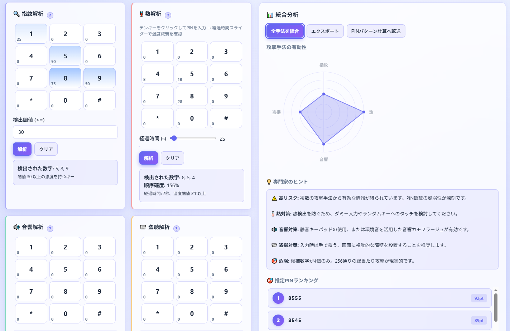

<!--
---
id: day088
slug: pin-threat-simulator

title: "PIN Threat Simulator"

subtitle_ja: "PIN認証攻撃シミュレーター"
subtitle_en: "PIN Authentication Attack Simulator"

description_ja: "暗証番号（PIN）認証に対する攻撃手法（指紋解析、熱解析、音響解析、盗撮解析）をシミュレーションし、防御策の有効性を理解するための教育用ツール"
description_en: "An educational tool that simulates attack techniques against PIN authentication (fingerprint residue, thermal analysis, acoustic inference, shoulder surfing) and demonstrates why defense strategies are effective"

category_ja:
  - 認証
  - PIN解析
category_en:
  - Authentication
  - PIN Cracking

difficulty: 5

tags:
  - pin
  - authentication
  - simulator
  - fingerprint
  - thermal-analysis
  - acoustic-analysis
  - shoulder-surfing
  - security-education
  - javascript
  - canvas

repo_url: "https://github.com/ipusiron/pin-threat-simulator"
demo_url: "https://ipusiron.github.io/pin-threat-simulator/"

hub: true
---
-->

# PIN Threat Simulator - PIN認証攻撃シミュレーター


[](https://ipusiron.github.io/pin-threat-simulator/)

**Day088 - 生成AIで作るセキュリティツール100**

**PIN Threat Simulator** は、暗証番号（PIN）認証に対する攻撃手法をシミュレーションし、どのように解析され得るか、そして防御策がなぜ有効なのかを理解するための教育用ツールです。

サポートする攻撃手法は以下のとおりです。

- 指紋解析
- 熱解析
- 音響解析
- 盗撮解析（ショルダーハッキングを含む）

---

## 🌐 デモページ

👉 **[https://ipusiron.github.io/pin-threat-simulator/](https://ipusiron.github.io/pin-threat-simulator/)**

ブラウザーで直接お試しいただけます。

---

## 📸 スクリーンショット

>
>*4タイプの攻撃の統合分析*

---

## 🔍 サポートする攻撃手法

### 1. 指紋解析（Fingerprint Residue Analysis）

**原理**: テンキー上に残る皮脂・指紋痕跡から、押下されたキーを特定

**シミュレーション内容**:
- 各キーの濃度（0～100）を設定可能
- 閾値設定により「押された可能性があるキー」を判定
- 例：4桁PINで3つの数字{2, 5, 9}が検出された場合
  - 候補数: 10,000通り → **256通り**（97.4%削減）

**実環境での検出方法**:
- 斜光照明による指紋可視化
- 紫外線ライトでの痕跡検出
- 高解像度マクロ撮影

**限界**:
- 押下順序は通常わからない
- 時間経過で痕跡が薄れる
- 同じ数字の重複使用を検出できない

---

### 2. 熱解析（Thermal Residue Analysis）

**原理**: サーマルカメラで入力直後の温度差から押下順序を推定

**シミュレーション内容**:
- リアルタイムの温度減衰シミュレーション（線形減衰: 1度/秒）
- テンキークリックで温度上昇（+10度、最大40度）
- 時間経過スライダー（0～60秒）が自動的に進行
- 左下の温度表示がリアルタイムでカウントダウン
- 「解析」ボタンで減衰を停止し、その時点での温度で解析
- 温度の高い順に押下順序を推定（確度表示付き）

**数学モデル**:
```
温度(t) = max(0, 初期温度 - t)  (t: 経過秒数)
減衰速度: 1度/秒
```

**実環境での検出方法**:
- FLIRなどのサーマルカメラ（解像度: 320×240以上推奨）
- 入力後5～10秒以内の撮影が効果的
- 温度差: 0.5℃程度でも検出可能

**限界**:
- 時間経過で情報が失われる（線形減衰）
- 環境温度の影響を受ける
- 複数回押されたキーは温度が加算される

**組み合わせ効果**:
- 指紋解析 + 熱解析 → 候補数: **24～48通り**（99.5%以上削減）

---

### 3. 音響解析（Acoustic Analysis）

**原理**: 打鍵音の波形解析からPIN桁数を推定

**シミュレーション内容**:
- 音声ファイルアップロード機能
- ピーク検出アルゴリズム（閾値: 0.15）
- サンプリングステップ: 200サンプルごと

**実環境での検出方法**:
- 高感度マイク（指向性マイク推奨）
- スマートフォンの録音機能
- 距離: 1～3m以内が理想

**得られる情報**:
- ✅ PIN桁数の高精度推定（正答率: 85%以上）
- ❌ 押された数字の特定は困難（反響・周波数解析が必要）

**組み合わせ効果**:
```
指紋解析で候補数字 {2, 5, 9} を検出
音響解析で桁数 4 を確定
→ 候補数を256通りに絞り込み＋桁数の確信度向上
```

---

### 4. 盗撮解析（Shoulder Surfing / Video Analysis）

**原理**: カメラによる視覚的盗撮で入力内容を推定

**シミュレーション内容**:
- 視点選択（真上 / 斜め45度）
- 視角誤差の設定（ピクセル単位、0-50px）
- 角度・距離による精度劣化を再現

**実環境での検出方法**:
- 小型カメラ（ペン型、メガネ型など）
- スマートフォンでの自然な撮影
- 防犯カメラ映像の解析

#### 検出精度への影響モデル

本シミュレーターでは、視点角度とピクセル誤差が検出精度に与える影響を以下のモデルで計算します。

##### 1. 視点角度（Viewing Angle）

**真上（top）**:
- 検出数: 入力されたすべての異なる数字を検出
- 信頼度ペナルティ: なし（基準値100%）
- 用途: 真上から設置された監視カメラ、または攻撃者が真上から撮影できる理想的な状況

**斜め（tilt）**:
- 検出数削減: `accuracy = max(0.5, 1 - pixelErr/50)`
  - 例: 誤差8px → accuracy=84% → 検出数は84%に削減
  - 例: 誤差25px → accuracy=50% → 検出数は50%に削減（下限）
- 信頼度ペナルティ: **-30%**
- 用途: 肩越し撮影、斜めに設置されたカメラ

##### 2. ピクセル誤差（Pixel Error）

ピクセル誤差は、カメラの解像度、撮影距離、手振れ、焦点ボケなどによる座標検出の不正確さを表します。

**低誤差（0-20px）**:
- 検出数: 削減なし（斜め視点の場合は上記の精度式で削減）
- 信頼度ペナルティ: `min(50, pixelErr × 1.5)%`
  - 8px → -12%
  - 15px → -22.5%
  - 20px → -30%

**高誤差（20px超）**:
- 検出数: **半分に削減**（`ceil(candidates.length / 2)`）
- 信頼度ペナルティ: 最大 **-50%**
  - 25px → -37.5%
  - 30px → -45%
  - 40px以上 → -50%（上限）

#### 具体的な計算例

**ケース1: 理想条件（真上・低誤差）**
- 設定: 視点=真上、誤差=8px
- 入力PIN: 1234（4つの異なる数字）
- **検出数**: 4個（100%）
- **信頼度**: 100 - 0 - 12 = **88%**
- **レーダーチャートスコア**: 4×15 + 88×0.5 = **104** → 100（上限）

**ケース2: 真上・高誤差**
- 設定: 視点=真上、誤差=25px
- 入力PIN: 1234（4つの異なる数字）
- **検出数**: 2個（高誤差により50%削減）
- **信頼度**: 100 - 0 - 37.5 = **62.5%**
- **レーダーチャートスコア**: 2×15 + 62.5×0.5 = **61**

**ケース3: 斜め・低誤差**
- 設定: 視点=斜め、誤差=8px
- 入力PIN: 1234（4つの異なる数字）
- **検出数**: 4 × max(0.5, 1-8/50) = 4 × 0.84 = 3.36 → 4個（切り上げ）
- **信頼度**: 100 - 30 - 12 = **58%**
- **レーダーチャートスコア**: 4×15 + 58×0.5 = **89**

**ケース4: 最悪条件（斜め・高誤差）**
- 設定: 視点=斜め、誤差=30px
- 入力PIN: 1234（4つの異なる数字）
- **検出数削減プロセス**:
  1. 斜め視点の精度: 4 × max(0.5, 1-30/50) = 4 × 0.5 = 2個
  2. 高誤差による半減: 2 / 2 = 1個
- **信頼度**: 100 - 30 - 45 = **25%**
- **レーダーチャートスコア**: 1×15 + 25×0.5 = **27.5**

#### スコア計算式

レーダーチャートの盗撮スコア（0-100）は以下の式で計算されます：

```
score = min(100, candidates.length × 15 + confidence × 0.5)
```

- `candidates.length`: 検出された異なる数字の個数（0-10）
- `confidence`: 信頼度（0-100%）
- 最大スコア理論値: 10×15 + 100×0.5 = 200（実際は100で上限クランプ）

#### 精度要因まとめ

| 条件 | 検出数への影響 | 信頼度への影響 | 総合評価 |
|------|-------------|-------------|---------|
| 真上・誤差8px | 100% | -12% | 最良（スコア約90-100） |
| 真上・誤差25px | 50%削減 | -37.5% | 中程度（スコア約60） |
| 斜め・誤差8px | 84%削減 | -42% | 中程度（スコア約70-80） |
| 斜め・誤差30px | 75%削減 | -75% | 最悪（スコア約20-30） |

**対策の有効性**:
- 手で画面を覆う → 検出率 0%（もっとも効果的）
- ランダム配置テンキー → 数字特定が無意味に（根本的解決）
- 入力時に体で遮蔽 → 視点を「斜め」以下に制限、誤差を増大させる

---

## 🧮 PINパターン計算法

本ツールは、複数の攻撃手法から得た情報を統合し、実際のPIN候補数を計算します。

### 計算モード

#### 1. 許容集合モード（Allowed Set Mode）
**定義**: 検出された数字のみを使用可能

**計算式**:
```
候補数 = |候補集合|^桁数
```

**例**:
- 候補集合: {2, 5, 9}、桁数: 4、重複あり
- 候補数: 3^4 = **81通り**

---

#### 2. 必須包含モード（Must Include Mode）
**定義**: 検出された数字をすべて含む必要がある

**計算式（包除原理）**:
```
候補数 = Σ(i=0→k) (-1)^i × C(k, i) × (A - i)^n

A: 全数字数（通常10）
k: 必須数字数
n: PIN桁数
C(k, i): 組み合わせ数
```

**例**:
- 必須集合: {2, 5, 9}、桁数: 4、重複あり
- 候補数: C(3,0)×10^4 - C(3,1)×9^4 + C(3,2)×8^4 - C(3,3)×7^4
- = 10,000 - 19,683 + 8,192 - 2,401 = **1,512通り**

---

#### 3. 部分特定モード（Partial Mode）
**定義**: 検出された数字が「可能性あり」だが他の数字も使える

**計算式**:
```
候補数 = 10^桁数（全パターン）
```

**用途**: 情報が不完全な場合のベースライン計算

---

### ワイルドカード機能

特定の桁が判明している場合の高度な計算

**書式**: カンマ区切りで各桁を指定、不明桁は `*`

**例**:
```
入力: *,*,2,*
意味: 3桁目が「2」で確定、他は不明

候補集合 {2, 5, 9}、重複あり の場合:
- 1桁目: 3通り（2, 5, 9）
- 2桁目: 3通り（2, 5, 9）
- 3桁目: 1通り（2のみ）
- 4桁目: 3通り（2, 5, 9）
→ 候補数: 3×3×1×3 = 27通り
```

---

### 重複制御

**重複あり（デフォルト）**:
- 同じ数字を複数回使用可能
- 例: 1111, 2255, 5929など

**重複なし**:
- 各数字は最大1回のみ
- 必須包含モード + 重複なし + 桁数=候補数の場合 → 順列計算
- 例: 候補{2,5,9}、桁数3、重複なし → 3! = **6通り**（259, 295, 529, 592, 925, 952）

---

### 計算の最適化

**候補数が多い場合**:
- 5,000通り以下: 全候補を列挙
- 5,001通り以上: 候補数のみ計算（メモリ節約）

**計算過程の可視化**:
- 「計算過程を表示」チェックボックス
- 包除原理の各項を段階的に表示
- 教育用途での理解促進

---

## 🛡️ 防御策のデモンストレーション

また、ATMなどで採用されている以下の対策もデモ表示できます：

### ランダム配置テンキー
毎回数字の配置が変わるインタラクティブデモ。指紋解析や盗撮による位置記憶攻撃を無効化します。

- **シャッフル機能**: ボタンを押すたびに数字の配置がランダムに変更
- **リセット機能**: 標準的な配置（1-9, *, 0, #）に戻す
- **クリック入力対応**: キャンバス上で実際にPINを入力可能

### 手で隠すモード（入力マスキングシミュレーション）

実際のPIN入力時に「途中から手で隠し始める」という現実的なシナリオをシミュレート。

#### 動作の流れ

```
ステップ1: 通常入力
  「1」「2」「3」「4」と入力
  → 表示: 1234

ステップ2: 手で隠すモードON（途中から警戒）
  チェックボックスをON
  → 表示: 1234（既に入力済みの数字はそのまま表示）

ステップ3: 手で隠しながら入力
  「5」を入力
  → 表示: 12345（入力直後の300msのみ見える）
  → 表示: 1234*（300ms後に自動マスク）

ステップ4: 手で隠すモードOFF（油断）
  チェックボックスをOFF
  → 表示: 1234*（一度隠した「5」はマスクされたまま）

ステップ5: 再び通常入力
  「6」を入力
  → 表示: 1234*6（手で隠していないので見える）
```

#### 重要な仕様

1. **永続的マスキング**: 手で隠した数字は、モードOFF後もマスクされたまま
2. **部分的保護**: 途中からモードONにした場合、それ以降の入力のみがマスク対象
3. **リアルタイム効果**: 入力直後300msだけ数字が見え、その後すぐマスク（実際の視認性を再現）
4. **クリア機能**: 「クリア」ボタンですべての入力とマスク状態をリセット

#### 教育的意義

- **現実的なシナリオ**: 最初は油断して入力し、途中で周囲に気づいて手で隠し始める行動パターン
- **不完全な防御の可視化**: 途中から隠しても、すでに見られた部分は保護できないことを実感
- **最初から隠す重要性**: 入力開始時点からマスキングすることの重要性を理解

### その他の防御策

- **複合認証**: 「カード + PIN」の重要性解説
- **痕跡クリーニング**: 使用後の画面清掃の有効性

---

## 👥 対象ユーザー

本ツールは以下のような方々を対象としています：

### 教育機関
- 📚 **情報セキュリティを学ぶ大学生・大学院生** - 認証システムの脆弱性を実践的に理解
- 🎓 **専門学校・高等専門学校の学生** - サイバーセキュリティ基礎教育の教材として
- 👨‍🏫 **セキュリティ講師・教員** - 授業や演習での実演デモ、課題作成に活用

### 企業・組織
- 💼 **セキュリティ担当者** - 社内研修での啓発活動、脅威モデリングの理解促進
- 👔 **一般社員** - セキュリティ意識向上研修、PIN管理の重要性理解
- 🔐 **情報セキュリティ管理者（CISO/CSO）** - 組織のリスク評価、対策検討の参考資料

### セキュリティ専門家
- 🛡️ **セキュリティエンジニア** - 認証システムの脆弱性分析、ペネトレーションテストの理論学習
- 🔍 **セキュリティリサーチャー** - 攻撃手法の組み合わせ効果の研究、防御策の評価
- 🏆 **CTF参加者** - セキュリティコンテストでの思考訓練、クリプト・フォレンジック分野の学習

### 個人学習者
- 💻 **独学でセキュリティを学ぶ方** - 実践的な攻撃シナリオの体験学習
- 🎯 **セキュリティエンジニア志望者** - 就職・転職前のスキル習得
- 🌟 **セキュリティに興味がある方** - PIN認証の仕組みと脆弱性の基礎知識獲得

### その他
- 📢 **セキュリティカンファレンス登壇者** - プレゼンテーションでのデモツール
- 📝 **技術ブロガー・YouTuber** - セキュリティ解説コンテンツの教材
- 🔬 **学術研究者** - 認証セキュリティ研究のシミュレーション環境

---

## タブ構成

本ツールは3つのタブで構成されています。

### 1. PINパターン計算
- 候補数字集合、PIN桁数、モード（許容集合 / 必須包含 / 部分特定）、重複可否を入力
- ワイルドカード `*` による不確定桁指定が可能
- 総候補数を計算し、最大1000件まで画面表示（全件はCSVエクスポート可能）
- 計算過程を表示（教育用）チェックボックスで段階的な計算プロセスを確認
- 「攻撃シミュレーション結果を使う」ボタンで攻撃結果を自動反映

### 2. 攻撃シミュレーション
統合インターフェイスで全攻撃手法を同時表示：

- **🔍 指紋解析**：テンキークリックで濃度を設定（0-100）、閾値により候補数字を検出
- **🌡️ 熱解析**：テンキークリックで温度上昇（最大40度）、リアルタイム減衰（1度/秒）、解析ボタンで停止
- **🔊 音響解析**：テンキークリックまたは音声ファイルアップロードで打鍵回数（桁数）を推定
- **📹 盗撮シミュレーション**：テンキー入力後、視点・誤差設定で検出精度を評価

**統合分析パネル**：
- 📊 レーダーチャート：各攻撃手法の有効性を可視化
- 💡 専門家のヒント：リスク評価と具体的な対策提案
- 🎯 推定PINランキング：統合スコアに基づくTOP10候補を表示
- 「全手法を統合」ボタンで結果を統合し、「PINパターン計算へ転送」で計算タブへ

### 3. セキュリティ解説
- **各攻撃への対策**：🔍指紋解析、🌡️熱解析、🔊音響解析、📹盗撮の4手法について「わかること/わからない/対策」を解説
- **ランダムテンキーのデモ**：シャッフル・リセット機能で配置変更の効果を体験
- **実運用チェックリスト**：チェックボックス形式で対策項目を確認  

---

## 🎯 活用シナリオ例

### シナリオ1: 大学セキュリティ講義での演習課題

**対象**: 情報セキュリティを学ぶ大学生・大学院生
**所要時間**: 90分

**実習の流れ**:
1. **導入（15分）**: ATM/スマートフォンのPIN認証の仕組みを説明
2. **攻撃手法の理解（30分）**:
   - 指紋解析で候補数字{2, 5, 9}を特定 → 4桁PINの候補が**256通り**に絞り込まれることを確認
   - 熱解析でテンキーをクリック → リアルタイムで温度が減衰する様子を観察 → 解析ボタンで停止
   - 音響解析でテンキーをクリックまたは音声ファイルから桁数を推定（4桁と判定）
   - 盗撮シミュレーションで視点・誤差による精度変化を確認
   - 統合分析パネルでレーダーチャート、専門家ヒント、PINランキングTOP10を確認
3. **候補計算の実行（20分）**:
   - 「全手法を統合」→「PINパターン計算へ転送」で結果を自動反映
   - モード切り替え（許容集合/必須包含/部分特定）による候補数の変化を比較
   - ワイルドカード機能で特定桁が判明している場合のシミュレーション
   - 候補一覧をCSVエクスポート（1000件超の場合）
4. **防御策の検討（25分）**:
   - 「セキュリティ解説」タブで各攻撃への対策カードを確認
   - ランダムテンキーデモでシャッフル・リセット機能を体験
   - 実運用チェックリストで対策項目を確認
   - レポート課題: 「複合的攻撃に対する多層防御の設計」

**学習成果**: 単一の脆弱性だけでなく、複数の攻撃手法を組み合わせることで探索空間が劇的に減少することを体験的に理解

---

### シナリオ2: 企業セキュリティ研修での意識向上

**対象**: 一般社員・セキュリティ担当者
**所要時間**: 60分

**研修の流れ**:
1. **現実の脅威紹介（10分）**: 実際に発生したPIN盗難事例の紹介
2. **実践デモンストレーション（30分）**:
   - 講師がライブデモで攻撃シミュレーションを実演
   - 参加者の誰かに4桁PINを入力してもらい（テンキーシミュレータ）、その直後に:
     - 指紋解析: 画面に残った指紋痕跡を観察（疑似）
     - 熱解析: 「入力後5秒」でどのキーが熱いか可視化
     - 盗撮: 斜め45度からの撮影でどこまで見えるか実演
   - 統合された情報から候補が**数十～数百通り**まで絞り込まれることを提示
3. **対策の実践（15分）**:
   - 手で画面を覆う動作の実演
   - ランダムテンキーの有効性確認
   - 複合認証（カード+PIN）の重要性説明
4. **質疑応答（5分）**

**学習成果**: 「PINは4桁=10,000通りだから安全」という誤解を解消し、物理的な痕跡管理の重要性を認識

---

### シナリオ3: セキュリティコンテスト・CTF形式の演習

**対象**: セキュリティエンジニア志望者・学生
**所要時間**: 120分（競技形式）

**競技ルール**:
1. **課題設定**:
   - 運営側が事前に「正解PIN」を設定（参加者には非公開）
   - 各チームに異なる制約条件を付与:
     - Aチーム: 指紋解析と音響解析のみ使用可能
     - Bチーム: 熱解析と盗撮のみ使用可能
     - Cチーム: 全手法使用可能だが時間制限が短い

2. **競技フェーズ（90分）**:
   - 各チームがツールを使って候補を絞り込み
   - 最終候補リストをCSVエクスポートして提出
   - 候補数が少ないほど高得点（ただし正解PINを含んでいることが条件）

3. **解説フェーズ（30分）**:
   - 最優秀チームの攻撃戦略を発表
   - 各攻撃手法の組み合わせによる候補削減率を比較分析:
     ```
     指紋のみ      : 10,000 → 256通り（97.4%削減）
     指紋+音響     : 10,000 → 256通り（桁数確定で検証効率化）
     指紋+熱+音響  : 10,000 → 24通り（99.8%削減）
     ```
   - 防御側視点での対策優先順位を議論

**学習成果**:
- 情報収集の多角化による効果的な攻撃戦略構築能力
- 限られたリソースでの最適化思考
- 攻撃者視点と防御者視点の両方からの分析力

---

### シナリオ4: レッドチームによる物理的ペネトレーションテスト事前訓練

**対象**: セキュリティコンサルタント・レッドチームメンバー
**所要時間**: 180分（事前学習 + 演習）

**重要**: 本シナリオは契約に基づく合法的なペネトレーションテストの事前訓練を想定しています。無許可での実施は厳禁です。

**訓練の流れ**:

#### フェーズ1: 脅威モデリング（45分）
1. **ターゲット環境の想定**:
   - オフィスビルのセキュリティゲート（カード + PIN認証）
   - 金融機関のATM（PIN 4桁）
   - データセンターの入退室管理（PIN 6桁）

2. **攻撃ベクター分析**:
   - 物理的アクセスの可能性評価
   - 監視カメラの配置と死角
   - 清掃スタッフ等の観察機会
   - ソーシャルエンジニアリングの組み合わせ

3. **本ツールでの事前検証**:
   ```
   想定: オフィス受付のPINパッドでターゲットが入力

   収集可能な情報:
   - 指紋痕跡: 退勤後のパッド表面撮影 → {1,4,7,9}を検出
   - 熱画像: 入力直後10秒以内の撮影 → 順序推定
   - 音響: スマホで5m離れた位置から録音 → 4桁確定

   本ツールで計算:
   - 候補集合モード、4桁、{1,4,7,9} → 256通り
   - 熱解析追加で順序制約 → 24通り程度
   - 総所要時間: 1分未満で全パターン試行可能
   ```

#### フェーズ2: 攻撃シミュレーション（60分）

1. **機材準備チェックリスト**:
   - 📷 小型カメラ（ペン型、ボタン型）
   - 🌡️ スマートフォン用サーマルカメラアタッチメント（FLIR ONE等）
   - 🎤 指向性マイク（または高性能スマホ）
   - 🔦 UV/斜光ライト（指紋可視化用）
   - 🧤 清掃員装備（カバーストーリー）

2. **本ツールでの訓練**:
   - **指紋解析訓練**:
     - 実際のテンキーパッド写真を用意
     - 濃度判定の精度向上（目視 vs 画像処理）
     - 閾値設定のチューニング

   - **熱解析訓練**:
     - 時間経過シミュレーションで最適撮影タイミング学習
     - 5秒、10秒、20秒での検出可能性比較
     - 環境温度（夏季/冬季）の影響評価

   - **音響解析訓練**:
     - サンプル音声での桁数推定精度検証
     - 距離・角度による影響確認
     - ノイズ環境下でのデータ品質評価

3. **統合分析演習**:
   ```
   シナリオ: 3つの情報源から得たデータの統合

   情報1（指紋）: {2,5,8,9} - 信頼度70%
   情報2（熱画像）: 順序は 5→?→9→? - 信頼度60%
   情報3（音響）: 4桁 - 信頼度90%

   本ツールでの分析:
   1. 全組み合わせ: 4^4 = 256通り
   2. 熱解析制約適用: 5が1桁目、9が3桁目 → 5*9* パターン
   3. ワイルドカード入力: 5,*,9,* で計算 → 16通り

   優先試行順: 5289, 5829, 5229, 5889...
   ```

#### フェーズ3: 防御側評価（45分）

1. **侵入検知の盲点発見**:
   - 本ツールで攻撃成功シナリオを構築
   - 現行セキュリティ対策の評価:
     ```
     対策A: 手で覆う習慣なし → 盗撮脆弱性: 高
     対策B: 固定配置テンキー → 指紋解析脆弱性: 高
     対策C: 画面清掃なし → 痕跡残存リスク: 高
     ```

2. **改善提案書作成**:
   - 本ツールの計算結果を根拠に使用
   - ランダム配置テンキーの効果を数値で示す
   - コスト vs リスク削減のバランス提示

3. **レッドチーム報告書への活用**:
   - 攻撃フローチャート作成
   - 候補削減プロセスの可視化
   - エグゼクティブサマリー用のインパクト数値
     - 「従来10,000通りの総当たりが必要だったPINが、物理的情報収集により**24通りまで削減可能**」

#### フェーズ4: 反省会・レッスンズラーンド（30分）

1. **倫理・法的境界の確認**:
   - ✅ 契約範囲内の行為
   - ❌ スコープ外への逸脱
   - 📝 証拠保全と報告義務

2. **実施上の注意点**:
   - カメラ撮影時の法的リスク（盗撮罪）
   - 他の従業員への影響（業務妨害）
   - データ保管のセキュリティ

3. **KPI設定**:
   - 情報収集成功率の目標値
   - 検出されないステルス性の維持
   - レポート品質基準

---

**訓練成果**:
- 物理的攻撃ベクターの実践的理解
- 複数情報源の統合分析能力
- クライアントへの説得力ある報告書作成スキル
- 倫理的・法的境界の明確な認識

**重要な注意事項**:
```
⚠️ 本シナリオは以下の条件下でのみ実施可能です：

✅ 必須条件:
1. 書面による契約（SOW: Statement of Work）
2. 対象組織の正式な許可書
3. 実施範囲・期間の明確な定義
4. 緊急連絡体制の確立
5. 損害賠償保険の加入

❌ 絶対禁止:
- 無許可での実施
- 契約範囲外への攻撃
- 得られた情報の第三者提供
- 個人的な興味本位での実験
```

---

## ⚠️ 免責・注意事項

### 教育目的専用

本ツールは **教育目的でのみ** 使用することを前提に開発されています。

**禁止事項**:
- ❌ 実際のシステムへの不正アクセス
- ❌ 他人のPIN情報の不正取得
- ❌ 犯罪行為への利用・応用
- ❌ 本人の許可なき実験・テスト

**許可される使用**:
- ✅ 大学・専門学校でのセキュリティ教育
- ✅ 企業内セキュリティ研修
- ✅ 個人学習・研究目的
- ✅ セキュリティ意識向上のための啓発活動

### データプライバシー

- すべての処理はブラウザー内で完結（サーバーへのデータ送信なし）
- 個人情報は一切収集・保存されません
- エクスポートされたファイルは利用者の責任で管理してください

### セキュリティ

詳細なセキュリティポリシーは [SECURITY.md](SECURITY.md) を参照してください。

### 免責

本ツールの使用により生じたいかなる損害についても、開発者は一切の責任を負いません。
教育目的以外での使用により発生した問題は、使用者が全責任を負います。

---

## 📁 ディレクトリー構成

```
pin-threat-simulator/
├── assets/              # 静的アセット
│   └── screenshot.png   # スクリーンショット画像
├── index.html           # メインHTML（3タブ構造のUI）
├── script.js            # アプリケーションロジック（計算エンジン・攻撃シミュレーター）
├── style.css            # スタイリング・テーマ設定
├── README.md            # プロジェクトドキュメント（機能説明・使い方）
├── TECHNICAL.md         # 技術ドキュメント（実装詳細・アルゴリズム解説）
├── CLAUDE.md            # 開発ガイド（Claude Code向けガイダンス）
├── SECURITY.md          # セキュリティポリシー・倫理ガイドライン
├── LICENSE              # MITライセンス
├── .gitignore           # Git除外設定
└── .nojekyll            # GitHub Pages設定（Jekyllビルド無効化）
```

---

## 🔧 開発者向け情報

### テクニカルドキュメント

本ツールの技術的な実装詳細、アルゴリズム、パフォーマンス最適化については、開発者向けドキュメントを参照してください。

👉 **[TECHNICAL.md](TECHNICAL.md)** - 技巧的な実装とコアロジックの解説

**主な内容:**
- PINパターン計算エンジン（包除原理、二項係数計算）
- 攻撃シミュレーションの信頼度モデル
- レーダーチャート描画（High DPI対応）
- 熱解析の指数減衰シミュレーション
- 音響解析のピーク検出アルゴリズム
- PINランキングの複合スコアリング
- 手で隠すモードの永続的マスキング
- パフォーマンス最適化手法

### 開発ガイド

Claude Code を使用した開発については、以下を参照してください。

👉 **[CLAUDE.md](CLAUDE.md)** - Claude Code 向け開発ガイダンス

---

## 📄 ライセンス

MIT License – 詳細は [LICENSE](LICENSE) を参照してください。

---

## 🛠 このツールについて

本ツールは、「生成AIで作るセキュリティツール100」プロジェクトの一環として開発されました。
このプロジェクトでは、AIの支援を活用しながら、セキュリティに関連するさまざまなツールを100日間にわたり制作・公開していく取り組みを行っています。

プロジェクトの詳細や他のツールについては、以下のページをご覧ください。

🔗 [https://akademeia.info/?page_id=42163](https://akademeia.info/?page_id=42163)
