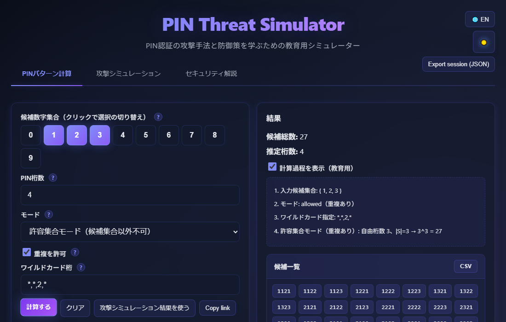
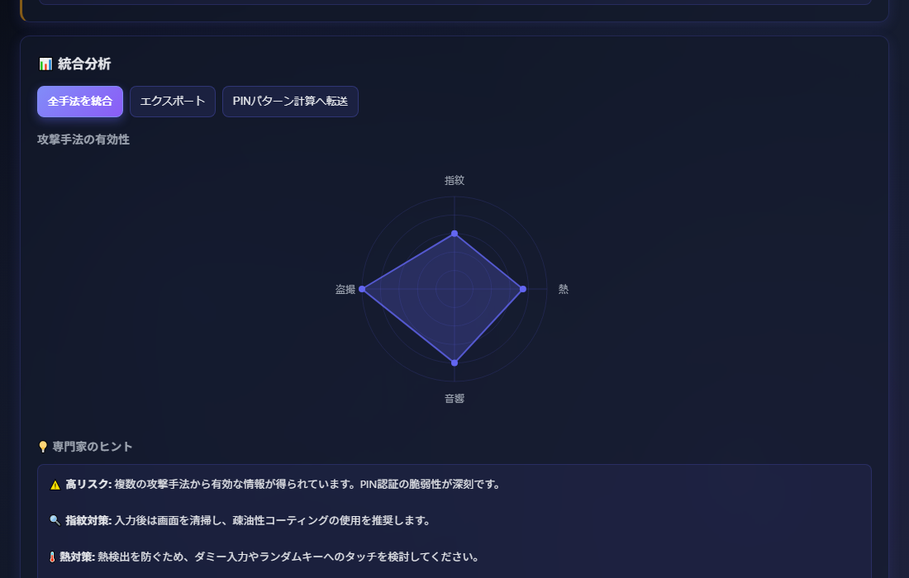
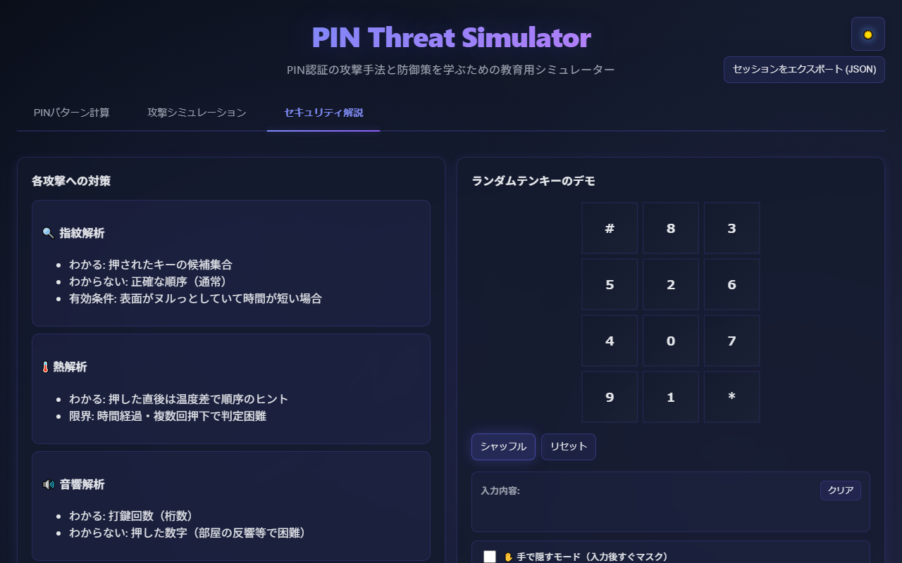

<!--
---
id: day088
slug: pin-threat-simulator

title: "PIN Threat Simulator"

subtitle_ja: "PIN認証攻撃シミュレーター"
subtitle_en: "PIN Authentication Attack Simulator"

description_ja: "暗証番号（PIN）認証に対する攻撃手法（指紋解析、熱解析、音響解析、盗撮解析）をシミュレーションし、防御策の有効性を理解するための教育用ツール"
description_en: "An educational tool that simulates attack techniques against PIN authentication (fingerprint residue, thermal analysis, acoustic inference, shoulder surfing) and demonstrates why defense strategies are effective"

category_ja:
  - 認証
  - PIN解析
category_en:
  - Authentication
  - PIN Cracking

difficulty: 5

tags:
  - pin
  - authentication
  - simulator
  - fingerprint
  - thermal-analysis
  - acoustic-analysis
  - shoulder-surfing
  - security-education
  - javascript
  - canvas

repo_url: "https://github.com/ipusiron/pin-threat-simulator"
demo_url: "https://ipusiron.github.io/pin-threat-simulator/"

hub: true
---
-->

# PIN Threat Simulator - PIN認証攻撃シミュレーター


[](https://ipusiron.github.io/pin-threat-simulator/)

**Day088 - 生成AIで作るセキュリティツール100**

**PIN Threat Simulator** は、暗証番号（PIN）認証に対する攻撃手法をシミュレーションし、どのように解析され得るか、そして防御策がなぜ有効なのかを理解するための教育用ツールです。

サポートする攻撃手法は以下のとおりです。

- 指紋解析
- 熱解析
- 音響解析
- 盗撮解析（ショルダーハッキングを含む）

---

## 🌐 デモページ

👉 **[https://ipusiron.github.io/pin-threat-simulator/](https://ipusiron.github.io/pin-threat-simulator/)**

ブラウザーで直接お試しいただけます。

---

## 📸 スクリーンショット

>
>*計算タブ: 候補集合{1,2,3}と`*,*,2,*`の指定で27通りに絞り込み*

>
>*攻撃シミュレーションタブ: 4手法の統合分析とレーダーチャート*

>
>*セキュリティ解説タブ: シャッフル後のランダム配置テンキー*

---

## ✨ 特徴

- 完全クライアントサイドで動作（データ送信なし）
- 外部APIも依存パッケージもなし。GitHub Pagesの直下で配信
- 計算エンジンは`pin-engine.js`に分離し、総当たりの参照実装によるテストで検証
- ダーク／ライトテーマ、prefers-reduced-motion対応、WCAG AA 相当の文字コントラスト
- MITライセンス

---

## 📖 使い方

### 1. PINパターン計算

1. 「候補数字集合」で押された可能性のある数字をクリックして選択します
2. 桁数、モード、重複可否を設定します
3. 必要ならワイルドカード（例: `*,*,2,*`）を入力して特定の桁を固定します
4. 「計算する」ボタンで候補総数と一覧を表示します
5. 「計算過程を表示」で各ステップの式を確認できます

### 2. 攻撃シミュレーション

1. 各手法のテンキーをクリックして濃度・温度・打鍵回数・入力PINを設定します
2. 各カードの「解析」ボタンで個別に解析します
3. 右側パネルの「全手法を統合」で、レーダーチャート・専門家のヒント・推定PINランキングを表示します
4. 「PINパターン計算へ転送」で結果を計算タブに渡します

### 3. セキュリティ解説

1. 各攻撃手法について「わかること／わからないこと／対策」を確認します
2. ランダム配置テンキーのデモで、シャッフルによる難化を体験します
3. 手で隠すモードを有効にして、途中からマスクを掛ける効果を確認します

---

## 📐 画面構成

本ツールは3つのタブで構成されています。

### 1. PINパターン計算

- 候補数字集合、PIN桁数、モード（許容集合／必須包含／部分特定）、重複可否を入力
- ワイルドカード `*` による不確定桁指定が可能
- 総候補数を計算し、最大1000件まで画面表示（全件はCSVエクスポート可能）
- 計算過程を表示（教育用）チェックボックスで段階的な計算プロセスを確認
- 「攻撃シミュレーション結果を使う」ボタンで攻撃結果を自動反映

### 2. 攻撃シミュレーション

統合インターフェイスで全攻撃手法を同時表示します。

- 🔍 指紋解析: テンキークリックで濃度を設定（0〜100）、閾値により候補数字を検出
- 🌡️ 熱解析: テンキークリックで温度上昇（最大40度）、リアルタイム減衰（1度／秒）、解析ボタンで停止
- 🔊 音響解析: テンキークリックまたは音声ファイルアップロードで打鍵回数（桁数）を推定
- 📹 盗撮シミュレーション: テンキー入力後、視点・誤差設定で検出精度を評価

統合分析パネル:

- 📊 レーダーチャート: 各攻撃手法の有効性を可視化
- 💡 専門家のヒント: リスク評価と具体的な対策提案
- 🎯 推定PINランキング: 統合スコアに基づくTOP10候補を表示
- 「全手法を統合」ボタンで結果を統合し、「PINパターン計算へ転送」で計算タブへ

### 3. セキュリティ解説

- 各攻撃への対策: 🔍指紋解析、🌡️熱解析、🔊音響解析、📹盗撮の4手法について「わかること／わからない／対策」を解説
- ランダムテンキーのデモ: シャッフル・リセット機能で配置変更の効果を体験
- 実運用チェックリスト: チェックボックス形式で対策項目を確認

---

## 🔍 サポートする攻撃手法

### 1. 指紋解析（Fingerprint Residue Analysis）

原理: テンキー上に残る皮脂・指紋痕跡から、押下されたキーを特定します。

シミュレーション内容:
- 各キーの濃度（0〜100）を設定可能
- 閾値設定により「押された可能性があるキー」を判定
- 例: 4桁PINで3つの数字{2, 5, 9}が検出された場合、許容集合モード・重複ありなら候補数は`3^4 = 81`通り

実環境での検出手法:
- 斜光照明による指紋可視化
- 紫外線ライトでの痕跡検出
- 高解像度マクロ撮影

限界:
- 押下順序は通常わからない
- 時間経過で痕跡が薄れる
- 同じ数字の重複使用を検出できない

---

### 2. 熱解析（Thermal Residue Analysis）

原理: サーマルカメラで入力直後の温度差から押下順序を推定します。

シミュレーション内容:
- リアルタイムの温度減衰シミュレーション（線形減衰: 1度／秒）
- テンキークリックで温度上昇（+10度、最大40度）
- 時間経過スライダー（0〜60秒）が自動的に進行
- 温度の高い順に押下順序を推定（確度表示付き）

数学モデル:

```
温度(t) = max(0, 初期温度 - t)   (t: 経過秒数)
減衰速度: 1度/秒
```

純粋な指数減衰モデルも `pin-engine.js` の `thermalDecay(T0, t, τ=20)` として用意しており、
`T(t) = T₀ × exp(-t/τ)` を返します。

実環境での検出手法:
- FLIRなどのサーマルカメラ（解像度320×240以上推奨）
- 入力後5〜10秒以内の撮影が効果的
- 温度差: 0.5℃程度でも検出可能

限界:
- 時間経過で情報が失われる
- 環境温度の影響を受ける
- 複数回押されたキーは温度が加算される

組み合わせ効果:
- 指紋解析 + 熱解析で、候補数と順序の両方を絞り込める

---

### 3. 音響解析（Acoustic Analysis）

原理: 打鍵音の波形解析からPIN桁数を推定します。

シミュレーション内容:
- 音声ファイルアップロード機能（上限20MB）
- ピーク検出アルゴリズム（二重閾値クロッシング: 立ち上がり0.3、立ち下がり0.1）
- サンプリングステップ: 200サンプルごと

実環境での検出手法:
- 高感度マイク（指向性マイク推奨）
- スマートフォンの録音機能
- 距離: 1〜3m以内が理想

得られる情報:
- ✅ PIN桁数の高精度推定
- ❌ 押された数字の特定は困難（反響・周波数解析が必要）

---

### 4. 盗撮解析（Shoulder Surfing / Video Analysis）

原理: カメラによる視覚的盗撮で入力内容を推定します。

シミュレーション内容:
- 視点選択（真上／斜め）
- 視角誤差の設定（ピクセル単位、0〜50px）
- 角度・距離による精度劣化を再現

#### 検出精度への影響モデル

視点角度とピクセル誤差が検出精度に与える影響は、次のモデルで計算します。

##### 1. 視点角度（Viewing Angle）

真上（top）:
- 検出数: 入力されたすべての異なる数字を検出
- 信頼度ペナルティ: なし（基準値100%）
- 用途: 真上から設置された監視カメラ、または攻撃者が真上から撮影できる理想的な状況

斜め（tilt）:
- 検出数の精度係数: `accuracy = max(0.5, 1 - pixelErr/50)`
  - 例: 誤差8px → accuracy=84% → 検出数は84%になる（16%減）
  - 例: 誤差25px → accuracy=50% → 検出数は50%になる（下限）
- 信頼度ペナルティ: -30%
- 用途: 肩越し撮影、斜めに設置されたカメラ

##### 2. ピクセル誤差（Pixel Error）

ピクセル誤差は、カメラの解像度、撮影距離、手振れ、焦点ボケなどによる座標検出の不正確さを表します。

低誤差（0〜20px）:
- 検出数: 削減なし（斜め視点の場合は上記の精度式で削減）
- 信頼度ペナルティ: `min(50, pixelErr × 1.5)%`
  - 8px → -12%
  - 15px → -22.5%
  - 20px → -30%

高誤差（20px超）:
- 検出数: 半分に削減（`ceil(candidates.length / 2)`）
- 信頼度ペナルティ: 最大 -50%
  - 25px → -37.5%
  - 30px → -45%
  - 40px以上 → -50%（上限）

#### 具体的な計算例

ケース1: 理想条件（真上・低誤差）
- 設定: 視点=真上、誤差=8px
- 入力PIN: 1234（4つの異なる数字）
- 検出数: 4個（100%）
- 信頼度: 100 - 0 - 12 = 88%
- レーダーチャートスコア: `min(100, 4×15 + 88×0.5) = 100`（上限）

ケース2: 真上・高誤差
- 設定: 視点=真上、誤差=25px
- 入力PIN: 1234
- 検出数: 2個（高誤差により半減）
- 信頼度: 100 - 0 - 37.5 = 62.5%
- レーダーチャートスコア: `2×15 + 62.5×0.5 = 61`

ケース3: 斜め・低誤差
- 設定: 視点=斜め、誤差=8px
- 入力PIN: 1234
- 検出数: `ceil(4 × 0.84) = 4`個
- 信頼度: 100 - 30 - 12 = 58%
- レーダーチャートスコア: `4×15 + 58×0.5 = 89`

ケース4: 最悪条件（斜め・高誤差）
- 設定: 視点=斜め、誤差=30px
- 入力PIN: 1234
- 検出数の計算: `ceil(4 × 0.5) = 2` → 高誤差で半減 → 1個
- 信頼度: 100 - 30 - 45 = 25%
- レーダーチャートスコア: `1×15 + 25×0.5 = 27.5`

#### スコア計算式

```
score = min(100, candidates.length × 15 + confidence × 0.5)
```

**対策の有効性は手で画面を覆うことが最も効果的で、ランダム配置テンキーは数字特定を無意味にする根本的解決です。**
- 手で画面を覆う: 検出率0%
- ランダム配置テンキー: 数字特定が無意味に
- 入力時に体で遮蔽: 視点を「斜め」以下に制限、誤差を増大させる

---

## 🧮 PINパターン計算法

本ツールは、複数の攻撃手法から得た情報を統合し、実際のPIN候補数を計算します。
入力は、候補集合 S、桁数 n、モード、重複可否、ワイルドカード（長さ n、各要素は `*` か 1 桁の数字）です。

### 計算モード

#### 1. 許容集合モード（Allowed Set Mode）

定義: 各桁は S から選びます。固定桁は指定の数字に固定し、その数字が S にない場合は候補 0 とします。

計算式:
- 重複あり: 自由桁数 f, A=|S| として `A^f`
- 重複なし: 固定桁を除いた残りの順列

例1 (重複あり):
- 候補集合: {2, 5, 9}、桁数: 4、ワイルドカードなし
- 候補数: `3^4 = 81`通り

例2 (重複あり＋固定桁):
- 候補集合: {2, 5, 9}、桁数: 4、`*,*,2,*`
- 候補数: 3桁目は2のみ、他は3通り → `3 × 3 × 1 × 3 = 27`通り

例3 (重複なし):
- 候補集合: {1, 2, 3, 4}、桁数: 4、ワイルドカードなし
- 候補数: `4! = 24`通り

---

#### 2. 必須包含モード（Must Include Mode）

定義: 各桁は S から選び、かつ **S のすべての数字を少なくとも1回含みます**。

計算式（重複あり、包除原理）:

```
count = Σ_{i=0..k'} (-1)^i × C(k', i) × (A - i)^f

A : |S|
f : 自由桁数（n - 固定桁数）
R : 固定桁で含まれていない必須数字の集合、k' = |R|
```

計算式（重複なし）:
- `n == |S|` のときのみ候補あり
- 固定桁を除いた残りの数字の順列

例4 (重複あり):
- 候補集合: {1, 2, 3}、桁数: 4、ワイルドカードなし
- 候補数: `3^4 - C(3,1)·2^4 + C(3,2)·1^4 - C(3,3)·0^4 = 81 - 48 + 3 - 0 = 36`通り

例5 (重複あり＋固定桁):
- 候補集合: {1, 2, 3}、桁数: 4、`*,*,2,*`
- 固定桁の 2 がすでに必須を1つ満たすので残りは {1, 3}（k'=2）、自由桁 f=3
- 候補数: `3^3 - C(2,1)·2^3 + C(2,2)·1^3 = 27 - 16 + 1 = 12`通り

---

#### 3. 部分特定モード（Partial Mode）

定義: 各桁は 0〜9 から選びます（S は使いません）。固定桁は同様です。

計算式:
- 重複あり: `10^f`
- 重複なし: 固定桁を除いた残りの順列

例6 (重複あり):
- 桁数: 4、ワイルドカードなし
- 候補数: `10^4 = 10,000`通り

例7 (重複あり＋固定桁):
- 桁数: 4、`*,*,2,*`
- 候補数: `10^3 = 1,000`通り

---

### ワイルドカードの書式

- カンマ区切りで各桁を指定
- 各要素は `*`（任意）か 1 桁の数字
- 長さが PIN 桁数と一致しない、あるいは不正なトークンがあると無視される

### 重複制御

重複あり（デフォルト）:
- 同じ数字を複数回使用可能
- 例: 1111、2255、5929 など

重複なし:
- 各数字は最大1回のみ
- 必須包含モード + 重複なしは、候補集合サイズと桁数が一致するときのみ候補がある
- 例: 候補{2,5,9}、桁数3、重複なし → `3! = 6`通り

### 計算の最適化

- 候補数が多い場合: 許容集合／必須包含モードは5,000通りまで、部分特定モードは500通りまで列挙
- それ以上は候補数のみを表示し、全列挙は行わない
- 画面表示は1,000件まで、全件はCSVエクスポートで取得可能

---

## 🛡️ 防御策のデモンストレーション

### ランダム配置テンキー

毎回数字の配置が変わるインタラクティブデモ。指紋解析や盗撮による位置記憶攻撃を無効化します。

- シャッフル機能: ボタンを押すたびに数字の配置がランダムに変更
- リセット機能: 標準的な配置（1-9, *, 0, #）に戻す
- クリック入力対応: キャンバス上で実際にPINを入力可能

### 手で隠すモード（入力マスキングシミュレーション）

実際のPIN入力時に「途中から手で隠し始める」という現実的なシナリオをシミュレートします。

#### 動作の流れ

```
ステップ1: 通常入力
  「1」「2」「3」「4」と入力
  → 表示: 1234

ステップ2: 手で隠すモードON（途中から警戒）
  チェックボックスをON
  → 表示: 1234（すでに入力済みの数字はそのまま表示）

ステップ3: 手で隠しながら入力
  「5」を入力
  → 表示: 12345（入力直後の300msのみ見える）
  → 表示: 1234*（300ms後に自動マスク）

ステップ4: 手で隠すモードOFF（油断）
  チェックボックスをOFF
  → 表示: 1234*（一度隠した「5」はマスクされたまま）

ステップ5: 再び通常入力
  「6」を入力
  → 表示: 1234*6（手で隠していないので見える）
```

#### 重要な仕様

1. 永続的マスキング: 手で隠した数字は、モードOFF後もマスクされたまま
2. 部分的保護: 途中からモードONにした場合、それ以降の入力のみがマスク対象
3. リアルタイム効果: 入力直後300msだけ数字が見え、その後すぐマスク
4. クリア機能: 「クリア」ボタンですべての入力とマスク状態をリセット

### その他の防御策

- 複合認証: 「カード + PIN」の重要性解説
- 痕跡クリーニング: 使用後の画面清掃の有効性

---

## 🎯 ユースケース

本ツールは、学習・業務・暮らし・趣味・研究・組み合わせの多様な場面で活用できます。
シミュレーションは簡略化したモデルであり、実機の攻撃成功率を保証するものではありません。

- 教育: 情報セキュリティの授業で、順列や包除原理を手で検算してから画面で確かめる題材として使う
- 教育: 数学の「場合の数」の例題として、桁数・候補集合・制約の変化で候補数がどう変わるかを体験する
- 仕事: 施設の暗証番号の運用ルール（桁数・定期変更・テンキーの清掃）を決める根拠として示す
- 仕事: 製品企画で、ランダム配置テンキーの効果を顧客や上長に説明するデモとして使う
- 暮らし: 自宅の金庫や宅配ボックスの暗証番号の選び方を家族で確認する
- 趣味・創作: 謎解きイベントや脱出ゲームの「残留指紋から暗証番号を推理する」出題の検算に使う
- 趣味・創作: ミステリー創作の取材資料として、物理サイドチャネルの限界と相性を把握する
- 研究: 物理的サイドチャネルの入門教材として、指紋・熱・音響の各手法の到達点を整理する
- 組み合わせ: 本シリーズの認証系ツールと並べて「PIN は短いので総当たりが現実的」なことを対比して示す

### シナリオ1: 大学セキュリティ講義での演習課題

対象: 情報セキュリティを学ぶ大学生・大学院生
所要時間: 90分

実習の流れ:
1. 導入（15分）: ATM/スマートフォンのPIN認証の仕組みを説明
2. 攻撃手法の理解（30分）:
   - 指紋解析で候補数字{2, 5, 9}を特定
   - 熱解析でテンキーをクリック → リアルタイムで温度が減衰する様子を観察 → 解析ボタンで停止
   - 音響解析でテンキーをクリックまたは音声ファイルから桁数を推定（4桁と判定）
   - 盗撮シミュレーションで視点・誤差による精度変化を確認
   - 統合分析パネルでレーダーチャート、専門家ヒント、PINランキングTOP10を確認
3. 候補計算の実行（20分）:
   - 「全手法を統合」→「PINパターン計算へ転送」で結果を自動反映
   - モード切り替え（許容集合／必須包含／部分特定）による候補数の変化を比較
   - ワイルドカード機能で特定桁が判明している場合のシミュレーション
   - 候補一覧をCSVエクスポート（1000件超の場合）
4. 防御策の検討（25分）:
   - 「セキュリティ解説」タブで各攻撃への対策カードを確認
   - ランダムテンキーデモでシャッフル・リセット機能を体験
   - 実運用チェックリストで対策項目を確認
   - レポート課題: 「複合的攻撃に対する多層防御の設計」

**学習成果として、単一の脆弱性だけでなく、複数の攻撃手法を組み合わせることで探索空間が大きく減少することを体験的に理解できます。**

### シナリオ2: 企業セキュリティ研修での意識向上

対象: 一般社員・セキュリティ担当者
所要時間: 60分

研修の流れ:
1. 現実の脅威紹介（10分）: 実際に発生したPIN盗難事例の紹介
2. 実践デモンストレーション（30分）:
   - 講師がライブデモで攻撃シミュレーションを実演
   - 参加者の誰かに4桁PINを入力してもらい、その直後に:
     - 指紋解析: 画面に残った指紋痕跡を観察（疑似）
     - 熱解析: 「入力後5秒」でどのキーが熱いか可視化
     - 盗撮: 斜め45度からの撮影でどこまで見えるか実演
   - 統合された情報から候補が数十〜数百通りまで絞り込まれることを提示
3. 対策の実践（15分）:
   - 手で画面を覆う動作の実演
   - ランダムテンキーの有効性確認
   - 複合認証（カード+PIN）の重要性説明
4. 質疑応答（5分）

学習成果: 「PINは4桁=10,000通りだから安全」という誤解を解消し、物理的な痕跡管理の重要性を認識できる。

### シナリオ3: セキュリティコンテスト・CTF形式の演習

対象: セキュリティエンジニア志望者・学生
所要時間: 120分（競技形式）

競技ルール:
1. 課題設定:
   - 運営側が事前に「正解PIN」を設定（参加者には非公開）
   - 各チームに異なる制約条件を付与:
     - Aチーム: 指紋解析と音響解析のみ使用可能
     - Bチーム: 熱解析と盗撮のみ使用可能
     - Cチーム: 全手法使用可能だが時間制限が短い
2. 競技フェーズ（90分）:
   - 各チームがツールを使って候補を絞り込み
   - 最終候補リストをCSVエクスポートして提出
   - 候補数が少ないほど高得点（ただし正解PINを含んでいることが条件）
3. 解説フェーズ（30分）:
   - 最優秀チームの攻撃戦略を発表
   - 各攻撃手法の組み合わせによる候補削減率を比較分析
   - 防御側視点での対策優先順位を議論

学習成果: 情報収集の多角化と、限られたリソースでの最適化思考を身につける。

### シナリオ4: レッドチームによる物理的ペネトレーションテスト事前訓練

対象: セキュリティコンサルタント・レッドチームメンバー
所要時間: 180分（事前学習＋演習）

本シナリオは、契約に基づく合法的なペネトレーションテストの事前訓練を想定します。無許可での実施は厳禁です。

訓練の流れ:

1. 脅威モデリング（45分）: ターゲット環境（ゲート／ATM／データセンター）の想定、攻撃ベクター分析、本ツールでの事前検証
2. 攻撃シミュレーション（60分）: 機材準備チェックリスト、本ツールでの訓練（指紋・熱・音響）、統合分析演習
3. 防御側評価（45分）: 侵入検知の盲点発見、改善提案書作成、レッドチーム報告書への活用
4. 反省会・レッスンズラーンド（30分）: 倫理・法的境界の確認、実施上の注意点、KPI設定

訓練成果: 物理的攻撃ベクターの実践的理解、複数情報源の統合分析能力、クライアントへの説得力ある報告書作成スキル、倫理的・法的境界の明確な認識。

重要な注意事項:

```
本シナリオは以下の条件下でのみ実施可能です。

必須条件:
1. 書面による契約（SOW: Statement of Work）
2. 対象組織の正式な許可書
3. 実施範囲・期間の明確な定義
4. 緊急連絡体制の確立
5. 損害賠償保険の加入

絶対禁止:
- 無許可での実施
- 契約範囲外への攻撃
- 得られた情報の第三者提供
- 個人的な興味本位での実験
```

---

## 🧪 テスト

本リポジトリーのテストは Node 22 の組み込みテストランナー（`node --test`）で動作し、依存パッケージはありません。

```bash
npm test
```

テスト内容:

- `test/engine.test.js`: 期待値15件と、総当たりの参照実装による多ケース照合
- `test/i18n.test.js`: `script.js` に日本語文字列リテラルが残っていないこと
- `test/html.test.js`: CSP meta、favicon、noscript、`type="module"`、主要id、インラインスタイル・ハンドラーなし
- `test/contrast.test.js`: ライト／ダーク両方で主要な文字／背景の組が WCAG AA 4.5:1 以上
- `test/format.test.js`: 行長・主要ファイルの行数下限
- `test/readme.test.js`: 本READMEの計算例、画像参照の実在、ディレクトリー構造の整合、禁止語チェック

CI は `.github/workflows/test.yml` が push と pull_request で Node 22 の `npm test` を実行します。

---

## 🔒 セキュリティ

- `index.html` に Content-Security-Policy の meta を設定（`default-src 'self'; script-src 'self'; style-src 'self'; img-src 'self' data: blob:; media-src 'self' blob:; connect-src 'self'; base-uri 'self'; form-action 'self'`）
- 外部 CDN や外部 API は使用していない
- テーマ設定（ダーク／ライト）のみを localStorage に保存
- 詳細は [SECURITY.md](SECURITY.md) を参照

`frame-ancestors` や `X-Content-Type-Options` は `<meta>` では無効のため、HTTP レスポンスヘッダーで追加設定することを推奨します。

---

## ⚠️ 免責・注意事項

### 教育目的専用

本ツールは、教育目的でのみ使用することを前提に開発されています。

禁止事項:
- 実際のシステムへの不正アクセス
- 他人のPIN情報の不正取得
- 犯罪行為への利用・応用
- 本人の許可なき実験・テスト

許可される使用:
- 大学・専門学校でのセキュリティ教育
- 企業内セキュリティ研修
- 個人学習・研究目的
- セキュリティ意識向上のための啓発活動

### データプライバシー

- すべての処理はブラウザー内で完結（サーバーへのデータ送信なし）
- 個人情報は一切収集・保存されない
- エクスポートされたファイルは利用者の責任で管理のこと

### 免責

本ツールの使用により生じたいかなる損害についても、開発者は一切の責任を負いません。
教育目的以外での使用により発生した問題は、使用者が全責任を負います。

---

## 🔧 開発者向け情報

### テクニカルドキュメント

👉 **[TECHNICAL.md](TECHNICAL.md)** - 実装詳細、アルゴリズム、信頼度モデル、テスト構成

主な内容:
- PINパターン計算エンジンの3モード仕様（固定桁の扱い、包除原理、順列）
- 攻撃シミュレーションの信頼度モデル
- レーダーチャート描画（High DPI対応）
- 熱解析の指数減衰モデル
- 音響解析の二重閾値ピーク検出
- PINランキングの複合スコアリング
- 手で隠すモードの永続的マスキング

### 開発ガイド

👉 **[CLAUDE.md](CLAUDE.md)** - Claude Code 向け開発ガイダンス（モジュール構成、辞書、テスト）

---

## 📁 ディレクトリー構造

```
pin-threat-simulator/
├── .github/
│   └── workflows/
│       └── test.yml       # push/PR時にNode 22でnpm testを実行するCI
├── assets/
│   ├── screenshot.png     # 計算タブのスクリーンショット
│   ├── screenshot2.png    # 攻撃シミュレーションタブのスクリーンショット
│   └── screenshot3.png    # セキュリティ解説タブのスクリーンショット
├── test/
│   ├── contrast.test.js   # ライト/ダークの文字コントラスト（WCAG AA）検証
│   ├── engine.test.js     # 計算エンジンの期待値＋総当たり参照実装による照合
│   ├── format.test.js     # 行長・主要ファイルの行数下限の検証
│   ├── html.test.js       # CSP/favicon/noscript/主要idなどのHTML検証
│   ├── i18n.test.js       # script.jsに日本語リテラルが残っていないことを検証
│   └── readme.test.js     # READMEの計算例・画像参照・禁止語の検証
├── .gitignore             # Git除外設定
├── .nojekyll              # GitHub Pages向けJekyllビルドの無効化
├── CLAUDE.md              # Claude Code向けの開発ガイダンス
├── LICENSE                # MITライセンス
├── README.md              # このファイル
├── SECURITY.md            # セキュリティポリシーとCSP
├── TECHNICAL.md           # 実装・アルゴリズムの技術ドキュメント
├── index.html             # メインHTML（3タブ構造のUI）
├── package.json           # npm testの定義（依存なし）
├── pin-engine.js          # 純粋な計算エンジン（モード別の候補計算など）
├── pts-messages.js        # 画面に出す日本語文言の辞書
├── script.js              # DOMと攻撃シミュレーションのロジック
└── style.css              # スタイル・テーマ（ダーク/ライト、reduced-motion）
```

---

## 💻 動作環境

- 最新の Chrome / Edge / Firefox / Safari（ES modules 対応ブラウザー）
- JavaScript 必須
- サーバー配信（`type="module"` のため `file://` では動作しません。開発時は `python -m http.server` などで配信してください）

---

## 📄 ライセンス

MIT License – 詳細は [LICENSE](LICENSE) を参照してください。

---

## 🛠️ このツールについて

本ツールは、「生成AIで作るセキュリティツール100」プロジェクトの一環として作成されました。
このプロジェクトでは、AIの支援を活用しながら、セキュリティに関連するツールを100日間にわたり制作・公開していくチャレンジに取り組んでいます。
プロジェクトの詳細や他のツールについては、以下のページをご覧ください。

🔗 [https://akademeia.info/?page_id=42163](https://akademeia.info/?page_id=42163)
